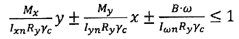
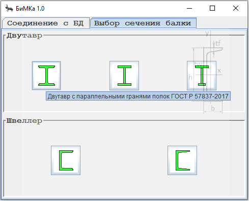
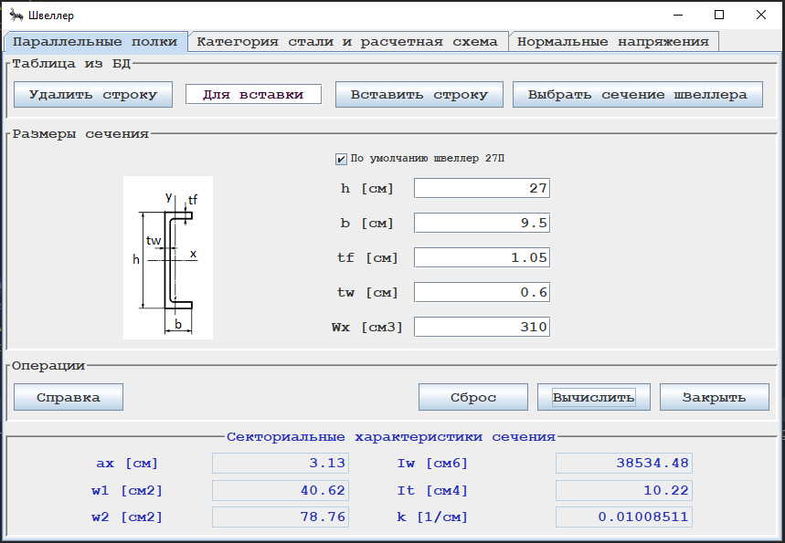
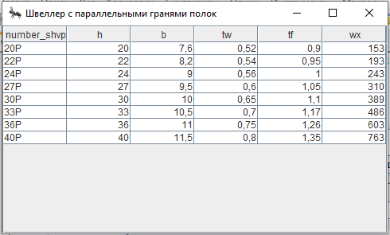
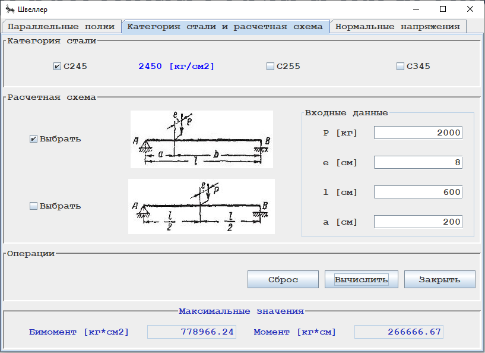
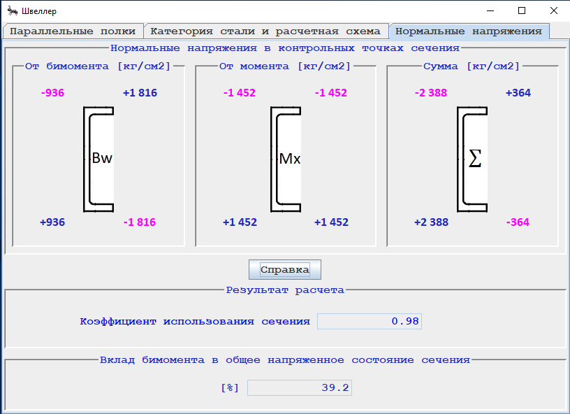

## ITMO.FinalWork.

### Настольное приложение для расчета стальных балок на бимомент.

#### Актуальность разработки: расчет балок на бимомент стал актуальным с выходом в свет СП 16.13330.2011
#### "Стальные конструкции".

#### Цель разработки: реализация расчета на прочность изгибаемых элементов сплошного сечения по формуле 43 
#### СП 16.13330.2017 с учетом бимомента (буквенное обозначение - B, см. рис.)

***Кнопки диалоговых окон приложения снабжены всплывающими подсказками:***

***Предусмотрена работа со следующими типами сечений:***

- прокатный швеллер с параллельными гранями полок;
- прокатный швеллер с уклоном внутренних граней полок;
- прокатный двутавр;
- двутавр сварной с двумя осями симметрии;
- двутавр сварной с одной осью симметрии.

***Вычисленные секториальные характеристики сечения обозначены в диалоговом окне синим цветом.***

***Предусмотрена возможность выбора необходимого сечения из БД.***

***Предусмотрен выбор категории стали и расчетной схемы. Реализована возможность указания***
***необходимых линейных размеров балки.***

***В ходе расчета определяется коэффициент использования сечения и процентный вклад бимомента в общее***
***напряженное состояние сечения. Если балка "не проходит" по результатам расчета,***
***появляется спец. знак красного цвета с восклицательным знаком.***

(<a href="#readme-top">back to top</a>)

